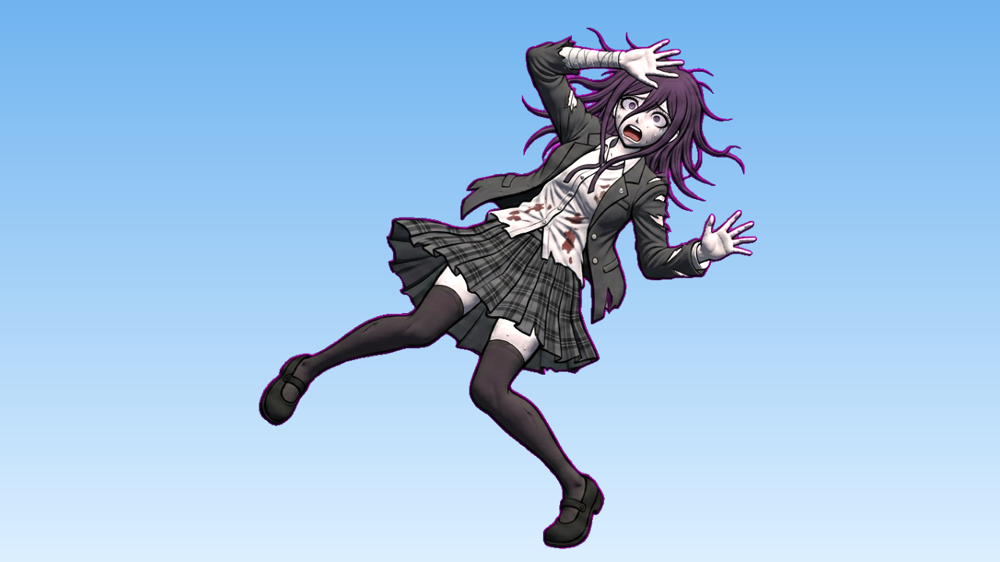
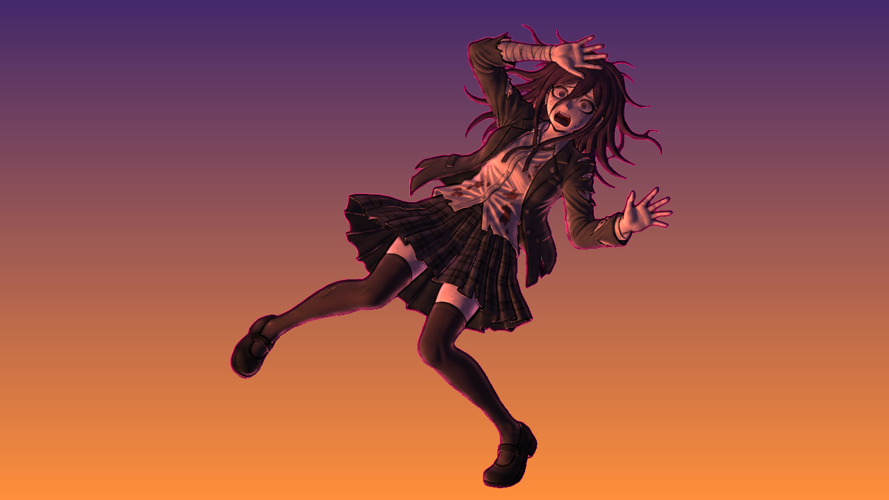
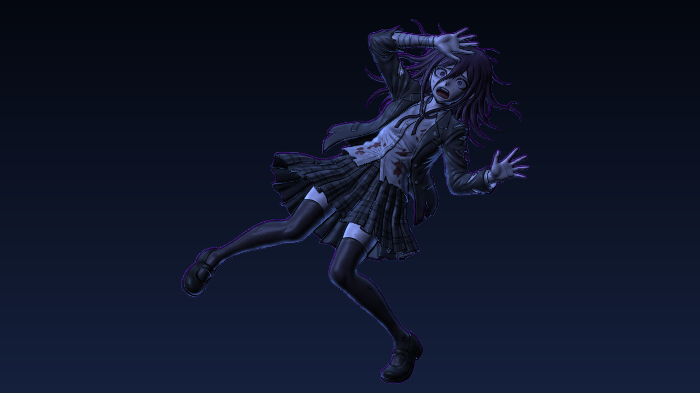
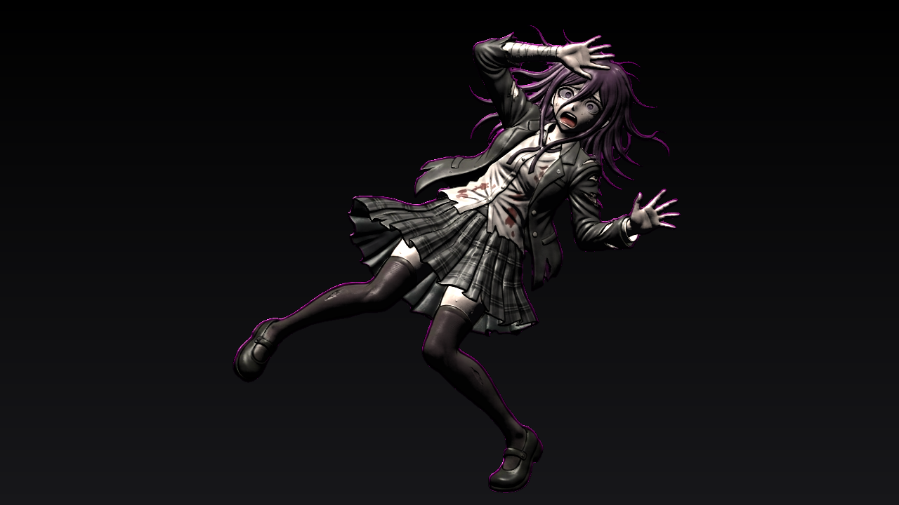
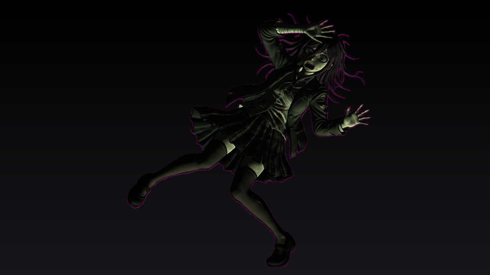
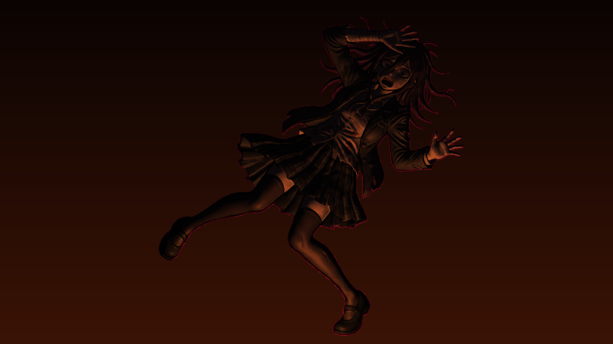
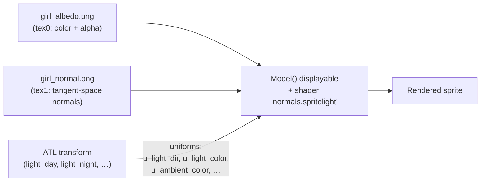

# Dynamic Sprite Lighting in Ren'Py (albedo + normal map)

**One sprite. One normal map. One shader. Only the light changes.**

A proof of concept for dynamically re-lighting visual novel character sprites in
[Ren'Py](https://www.renpy.org/) using a tangent-space normal map and a small GLSL
shader — no pre-rendered lighting variants, no per-scene sprite edits.

📺 **Video demo:** _(YouTube link pending)_

| Daylight | Sunset | Night |
|---|---|---|
|  |  |  |

| Harsh top light | Horror under-light | Campfire (animated point light) |
|---|---|---|
|  |  |  |

## How it works

Ren'Py 7.4+ ships a model-based renderer that lets you build a displayable out of
multiple textures and a custom shader. The whole trick is three pieces:



### 1. The sprite is a `Model` with two textures

```renpy
image girl = Model().texture("images/girl_albedo.png", fit=True) \
                    .texture("images/girl_normal.png") \
                    .shader("normals.spritelight")
```

### 2. A small fragment shader does the lighting

Registered once with `renpy.register_shader()`. It decodes the normal map,
computes Lambert diffuse + Blinn-Phong specular + a rim term, and supports two
light kinds: **directional** (sun, moon) and **point** (candle, campfire) with
aspect-corrected distance falloff:

```glsl
vec4 albedo = texture2D(tex0, v_tex_coord);
vec3 n = normalize(texture2D(tex1, v_tex_coord).rgb * 2.0 - 1.0);

float diff = max(dot(n, L), 0.0);                       // Lambert
vec3  h    = normalize(L + vec3(0.0, 0.0, 1.0));        // Blinn-Phong
float spec = pow(max(dot(n, h), 0.0), u_shininess) * u_spec_strength;
float rim  = pow(clamp(1.0 - n.z, 0.0, 1.0), u_rim_power);

vec3 light = u_ambient_color + u_light_color * diff * atten;
vec3 color = albedo.rgb * light
           + (u_light_color * spec * atten + u_rim_color * rim) * albedo.a;
gl_FragColor = vec4(color, albedo.a);
```

One gotcha: Ren'Py loads textures with **premultiplied alpha**, so the additive
terms (specular, rim) must be multiplied by `albedo.a`, or they glow outside the
sprite's silhouette.

### 3. Lights are just ATL transforms

Any transform property starting with `u_` is passed to the shader as a uniform.
That means a "lighting rig" is a plain transform, and switching lights is a
regular `show` statement:

```renpy
show girl at girl_stage, light_night
```

Even better: **ATL interpolates uniforms**, so animated lighting needs zero
per-frame Python. The campfire flicker is literally this:

```renpy
transform light_fire:
    u_light_pos (0.5, 0.95, 0.30)
    u_light_color (1.30, 0.62, 0.25)
    block:
        linear 0.09 u_light_color (1.10, 0.50, 0.20) u_light_pos (0.485, 0.96, 0.28)
        linear 0.13 u_light_color (1.40, 0.68, 0.28) u_light_pos (0.515, 0.94, 0.33)
        ...
        repeat
```

For the interactive scene, an ATL `function` reads `renpy.get_mouse_pos()` each
frame, maps it into sprite UV space, and writes `u_light_pos` — the point light
follows the cursor in real time.

## Files

| File | What it is |
|---|---|
| `game/shaders.rpy` | Shader registration + all lighting transforms/presets |
| `game/script.rpy` | Interactive demo: menu hub with 8 lighting scenarios |
| `game/videodemo.rpy` | Scripted, non-interactive run for screen recording |
| `game/autotest.rpy` | Headless self-check: renders every preset to `poc_shots/` |
| `record_video.sh` | Records the demo to `poc_video.mp4` via Xvfb + ffmpeg |
| `sprites/` | Source art: albedo, normal map, and Krita (.kra) files |

## Running it

Drop a Ren'Py SDK (8.x) into `renpy-sdk/` (or use your own install), then:

```bash
./renpy-sdk/renpy.sh .                      # interactive demo
RENPY_POC_AUTOTEST=1 ./renpy-sdk/renpy.sh . # render all presets to poc_shots/
./record_video.sh                           # record the full video (needs Xvfb, ffmpeg, xdotool)
```

## Making normal maps for sprites

The normal map used here was generated from the albedo art (tools like
[Laigter](https://azagaya.itch.io/laigter), [SpriteIlluminator](https://www.codeandweb.com/spriteilluminator),
or Blender bakes all work) and touched up in Krita — the `.kra` sources are in
`sprites/`. The shader expects OpenGL-style green-up maps; DirectX-style maps
work by passing `flip_green=1.0` to the light transforms.

## Credits & disclaimer

- Code: MIT (see `LICENSE`).
- The character sprite is fan-derived artwork based on a character from the
  *Danganronpa* series (© Spike Chunsoft). It is included solely as a
  non-commercial technical demonstration and is **not** covered by the MIT
  license. If you reuse this technique, swap in your own art.
